# Sơ Đồ Kiến Trúc Hệ Thống FieldKit

Sơ đồ này mô tả kiến trúc tổng thể của hệ thống FieldKit với các công nghệ AWS được sử dụng.

```mermaid
graph TB
    subgraph "Client Layer"
        Mobile[📱 Mobile App<br/>Flutter/Dart]
        Web[🌐 Web Portal<br/>Vue.js SPA]
    end

    subgraph "AWS Cloud - Internet Gateway"
        subgraph "Load Balancing Layer"
            ALB[⚖️ Application Load Balancer<br/>ALB<br/>HTTP/HTTPS Layer 7]
            NLB_PG[⚖️ Network Load Balancer<br/>NLB - PostgreSQL<br/>TCP Layer 4]
            NLB_TS[⚖️ Network Load Balancer<br/>NLB - TimescaleDB<br/>TCP Layer 4]
        end

        subgraph "VPC - Virtual Private Cloud"
            subgraph "Public Subnets - Multi-AZ"
                subgraph "ECS Cluster - Application"
                    subgraph "ECS Service - Server"
                        Server1[🐳 Server Task 1<br/>Go Backend + Vue.js Portal<br/>ECS Fargate]
                        Server2[🐳 Server Task 2<br/>Go Backend + Vue.js Portal<br/>ECS Fargate]
                    end
                    
                    subgraph "ECS Service - Charting"
                        Charting1[📊 Charting Task 1<br/>TypeScript Service<br/>ECS Fargate]
                        Charting2[📊 Charting Task 2<br/>TypeScript Service<br/>ECS Fargate]
                    end
                end

                subgraph "ECS Cluster - Database"
                    subgraph "ECS Service - PostgreSQL"
                        PG1[🐘 PostgreSQL Task 1<br/>PostgreSQL Database<br/>ECS Fargate]
                        PG2[🐘 PostgreSQL Task 2<br/>PostgreSQL Database<br/>ECS Fargate]
                    end
                    
                    subgraph "ECS Service - TimescaleDB"
                        TS1[📈 TimescaleDB Task 1<br/>TimescaleDB<br/>ECS Fargate]
                        TS2[📈 TimescaleDB Task 2<br/>TimescaleDB<br/>ECS Fargate]
                    end
                end
            end
        end

        subgraph "AWS Services"
            ECR[📦 Elastic Container Registry<br/>ECR<br/>Docker Images]
            S3[🗄️ Simple Storage Service<br/>S3<br/>Media Files & Streams]
            Secrets[🔐 Secrets Manager<br/>Database URLs & Keys]
            IAM[🛡️ Identity & Access Management<br/>IAM<br/>Roles & Policies]
            CloudWatch[📊 CloudWatch Logs<br/>Centralized Logging]
        end
    end

    subgraph "FieldKit Stations"
        Station1[📡 Station 1<br/>Hardware Device]
        Station2[📡 Station 2<br/>Hardware Device]
        StationN[📡 Station N<br/>Hardware Device]
    end

    %% Client to ALB
    Mobile -->|HTTPS/API| ALB
    Web -->|HTTPS/API| ALB

    %% ALB to Server Tasks
    ALB -->|HTTP| Server1
    ALB -->|HTTP| Server2

    %% Server to Charting
    Server1 -->|Internal API| Charting1
    Server1 -->|Internal API| Charting2
    Server2 -->|Internal API| Charting1
    Server2 -->|Internal API| Charting2

    %% Server to Databases via NLB
    Server1 -->|TCP 5432| NLB_PG
    Server1 -->|TCP 5432| NLB_TS
    Server2 -->|TCP 5432| NLB_PG
    Server2 -->|TCP 5432| NLB_TS

    NLB_PG -->|TCP| PG1
    NLB_PG -->|TCP| PG2
    NLB_TS -->|TCP| TS1
    NLB_TS -->|TCP| TS2

    %% Charting to Databases
    Charting1 -->|TCP 5432| NLB_PG
    Charting1 -->|TCP 5432| NLB_TS
    Charting2 -->|TCP 5432| NLB_PG
    Charting2 -->|TCP 5432| NLB_TS

    %% ECS Tasks to AWS Services
    Server1 -->|Pull Images| ECR
    Server2 -->|Pull Images| ECR
    Charting1 -->|Pull Images| ECR
    Charting2 -->|Pull Images| ECR
    PG1 -->|Pull Images| ECR
    PG2 -->|Pull Images| ECR
    TS1 -->|Pull Images| ECR
    TS2 -->|Pull Images| ECR

    Server1 -->|Read/Write| S3
    Server2 -->|Read/Write| S3

    Server1 -->|Get Secrets| Secrets
    Server2 -->|Get Secrets| Secrets
    Charting1 -->|Get Secrets| Secrets
    Charting2 -->|Get Secrets| Secrets
    PG1 -->|Get Secrets| Secrets
    PG2 -->|Get Secrets| Secrets
    TS1 -->|Get Secrets| Secrets
    TS2 -->|Get Secrets| Secrets

    Server1 -->|Assume Role| IAM
    Server2 -->|Assume Role| IAM
    Charting1 -->|Assume Role| IAM
    Charting2 -->|Assume Role| IAM

    Server1 -->|Write Logs| CloudWatch
    Server2 -->|Write Logs| CloudWatch
    Charting1 -->|Write Logs| CloudWatch
    Charting2 -->|Write Logs| CloudWatch
    PG1 -->|Write Logs| CloudWatch
    PG2 -->|Write Logs| CloudWatch
    TS1 -->|Write Logs| CloudWatch
    TS2 -->|Write Logs| CloudWatch

    %% Stations to Server
    Station1 -->|HTTPS/Upload Data| ALB
    Station2 -->|HTTPS/Upload Data| ALB
    StationN -->|HTTPS/Upload Data| ALB

    %% Styling
    classDef clientStyle fill:#e1f5ff,stroke:#01579b,stroke-width:2px
    classDef loadBalancerStyle fill:#fff3e0,stroke:#e65100,stroke-width:2px
    classDef serverStyle fill:#f3e5f5,stroke:#4a148c,stroke-width:2px
    classDef dbStyle fill:#e8f5e9,stroke:#1b5e20,stroke-width:2px
    classDef awsStyle fill:#fff9c4,stroke:#f57f17,stroke-width:2px
    classDef stationStyle fill:#fce4ec,stroke:#880e4f,stroke-width:2px

    class Mobile,Web clientStyle
    class ALB,NLB_PG,NLB_TS loadBalancerStyle
    class Server1,Server2,Charting1,Charting2 serverStyle
    class PG1,PG2,TS1,TS2 dbStyle
    class ECR,S3,Secrets,IAM,CloudWatch awsStyle
    class Station1,Station2,StationN stationStyle
```

## Mô Tả Kiến Trúc

### 1. Client Layer
- **Mobile App (Flutter)**: Ứng dụng mobile cho iOS và Android
- **Web Portal (Vue.js)**: Single-page application để quản lý stations và xem dữ liệu

### 2. Load Balancing Layer
- **Application Load Balancer (ALB)**: 
  - Phân phối HTTP/HTTPS traffic đến server tasks
  - Health checks và auto failover
  - SSL/TLS termination
  
- **Network Load Balancer (NLB)**:
  - PostgreSQL NLB: TCP load balancing cho PostgreSQL connections
  - TimescaleDB NLB: TCP load balancing cho TimescaleDB connections

### 3. Application Layer (ECS Fargate)
- **Server Service**: 
  - Go backend API
  - Vue.js portal (served as SPA)
  - Auto-scaling với multiple tasks
  
- **Charting Service**:
  - TypeScript service cho visualization
  - Tạo và hiển thị biểu đồ dữ liệu

### 4. Database Layer (ECS Fargate)
- **PostgreSQL**:
  - Lưu trữ metadata, relational data
  - PostGIS extension cho geographical data
  - Multi-AZ deployment
  
- **TimescaleDB**:
  - Time-series database cho sensor data
  - High-performance cho time-series queries
  - Multi-AZ deployment

### 5. AWS Services
- **ECR**: Lưu trữ Docker images cho tất cả services
- **S3**: Lưu trữ media files, streams, và static assets
- **Secrets Manager**: Lưu trữ database connection strings và session keys
- **IAM**: Quản lý roles và permissions cho ECS tasks
- **CloudWatch Logs**: Centralized logging cho tất cả services

### 6. FieldKit Stations
- Hardware devices gửi sensor data lên server qua HTTPS
- Upload data qua ALB đến server tasks

## Tính Năng Chính

### Scalability
- Auto-scaling với ECS và Fargate
- Multiple tasks cho high availability
- Multi-AZ deployment

### Security
- IAM roles và policies
- Secrets Manager cho credentials
- Security Groups cho network isolation
- VPC cho network boundaries

### Reliability
- Health checks và auto failover
- Load balancing
- Multi-AZ deployment
- Rolling updates không downtime

### Cost-effectiveness
- Pay-per-use với Fargate
- Không cần quản lý EC2 instances
- Serverless architecture

### Operational Excellence
- Centralized logging với CloudWatch
- Container orchestration với ECS
- Automated deployments
- Infrastructure as Code

